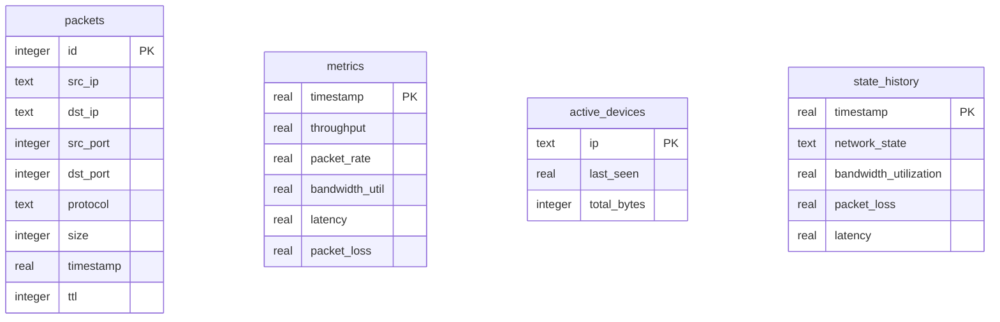

# Database Design - NetInsight-X

NetInsight-X uses SQLite to store real-time packet information, aggregate metrics, active device details, and state transitions.

---

## Entity-Relationship (ER) Diagram

---

## Relational Tables

### 1. `packets`
Stores parsed packet headers captured by Scapy or simulated in replay mode.

| Column | Type | Constraints | Description |
| :--- | :--- | :--- | :--- |
| `id` | INTEGER | PRIMARY KEY AUTOINCREMENT | Unique packet ID |
| `src_ip` | TEXT | | Source IP address |
| `dst_ip` | TEXT | | Destination IP address |
| `src_port` | INTEGER | | Source TCP/UDP port (0 for ICMP) |
| `dst_port` | INTEGER | | Destination TCP/UDP port (0 for ICMP) |
| `protocol` | TEXT | | Protocol label (TCP, UDP, ICMP) |
| `size` | INTEGER | | Size of packet in bytes |
| `timestamp` | REAL | | Arrival time (epoch format) |
| `ttl` | INTEGER | | Time-to-Live field |

**Index:** `idx_packets_timestamp` on `packets(timestamp)`. Used for analytics queries within time ranges.

---

### 2. `metrics`
Stores aggregated traffic metrics calculated at 2-second windows.

| Column | Type | Constraints | Description |
| :--- | :--- | :--- | :--- |
| `timestamp` | REAL | PRIMARY KEY | Aggregation timestamp (epoch format) |
| `throughput` | REAL | | Throughput in bits per second (bps) |
| `packet_rate` | REAL | | Packet rate in packets per second (pps) |
| `bandwidth_util`| REAL | | Percentage bandwidth utilization |
| `latency` | REAL | | Estimated average latency (seconds) |
| `packet_loss` | REAL | | Estimated percentage packet loss |

**Index:** `idx_metrics_timestamp` on `metrics(timestamp)`.

---

### 3. `active_devices`
Maintains records of active devices transmitting traffic through the monitored network.

| Column | Type | Constraints | Description |
| :--- | :--- | :--- | :--- |
| `ip` | TEXT | PRIMARY KEY | IP address of the device |
| `last_seen` | REAL | | Last observed activity timestamp |
| `total_bytes` | INTEGER | | Total volume of traffic in bytes sent |

---

### 4. `state_history`
Stores network states classified at 2-second windows. Used by the Markov Chain predictor to estimate transition matrices without repeatedly querying the massive raw packets table.

| Column | Type | Constraints | Description |
| :--- | :--- | :--- | :--- |
| `timestamp` | REAL | PRIMARY KEY | Measurement timestamp (epoch format) |
| `network_state` | TEXT | | Classification (NORMAL, BUSY, CONGESTED, FAILURE) |
| `bandwidth_utilization` | REAL | | Bandwidth utilization coefficient |
| `packet_loss` | REAL | | Packet loss coefficient |
| `latency` | REAL | | Average latency (seconds) |

**Index:** `idx_state_history_timestamp` on `state_history(timestamp)`.
