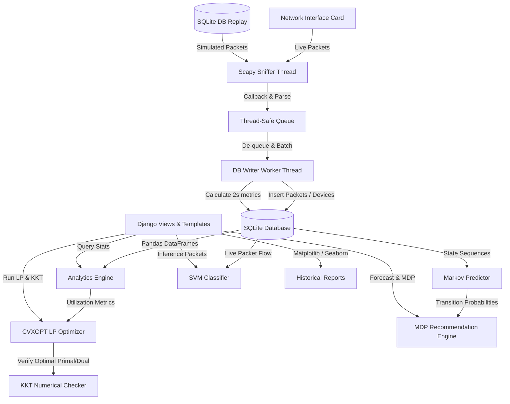
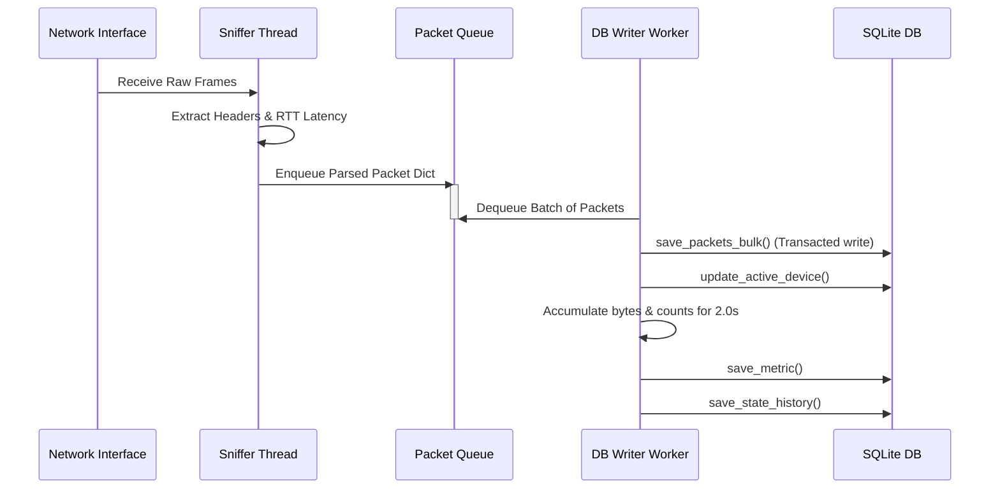
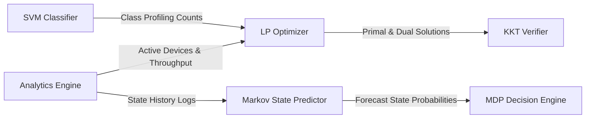
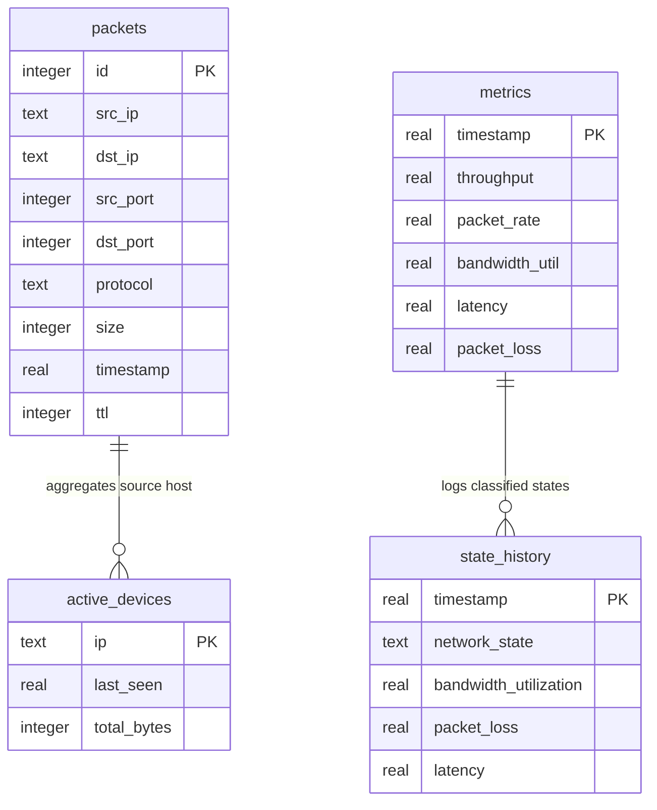

# NetInsight-X: An Intelligent Decision Support System for Network Monitoring, Traffic Analytics, Optimization, and Predictive Network Management

---

## Abstract
Modern computer networks require robust, real-time management paradigms to sustain Quality of Service (QoS) guarantees under dynamic traffic patterns. Traditional network monitors only display simple aggregated statistics, requiring human administrators to manual analyze states and determine administrative actions. This paper presents **NetInsight-X**, a modular, multi-threaded Decision Support System (DSS) integrating computer networks, mathematical optimization, and machine learning. NetInsight-X captures live LAN packet metrics, aggregates metrics to identify traffic patterns, optimizes bandwidth allocation using Linear Programming (LP), predicts future states using Markov Chains, and recommends advisory actions via Markov Decision Processes (MDP). An RBF Kernel Support Vector Machine (SVM) classifies traffic flows into application categories to inform optimization bounds. Numerical verification of Karush-Kuhn-Tucker (KKT) optimality conditions ensures solver accuracy, establishing a mathematically sound and explainable network management DSS framework.

---

## 1. Introduction & Background
Computer network analytics has transitioned from simple passive monitors to proactive management systems. As bandwidth demand scales with services (e.g. video streaming, web conferences, file sharing), static bandwidth allocation results in congested links, packet drops, and degraded QoS.

NetInsight-X functions as a **Decision Support System (DSS)** that translates raw network measurements into predictive models and optimal decisions. The pipeline is split into:
1. **Acquisition:** Multi-threaded Scapy sniffers capture header data.
2. **Analysis:** Aggregate metrics (throughput, latency, packet loss) are written to SQLite.
3. **Intelligence:** Markov state transition probability models predict future load profiles, and an RBF SVM classifies traffic flows.
4. **Optimization:** CVXOPT solves a convex Linear Programming problem allocating bandwidth to satisfy QoS, numerically verified via KKT conditions.
5. **Decision:** An MDP utilizes Bellman updates to recommend advisory traffic management options.

---

## 2. Software Requirements Specification (SRS)

### 2.1 Project Scope
NetInsight-X encompasses real-time capture queue buffering, analytics computations, optimization solves, state forecasting, flow classification, and a dashboard. The system restricts action recommendation to an *advisory capacity only*, intentionally excluding active software-defined control (SDN) or device configurations.

### 2.2 Functional Requirements (FR)
- **FR-1 (Capture):** Acquire live packets continuously on a background thread without blocking the UI or database operations.
- **FR-2 (Replay):** Simulate packet events via a Demonstration Replay Mode when physical interface access is restricted.
- **FR-3 (Storage):** Commit packet header data and periodic metrics logs to SQLite.
- **FR-4 (Analytics):** Compute throughput, protocol distributions, top consumer IPs, and active device counts.
- **FR-5 (Optimization):** Solve bandwidth allocations under QoS constraints and execute proportional fallbacks on solver failures.
- **FR-6 (KKT Checking):** Verify primal feasibility, dual feasibility, complementary slackness, and stationarity numerically.
- **FR-7 (Prediction):** Classify network states and estimate Markov transition probability matrices.
- **FR-8 (Recommendation):** Solve Value Iteration on an MDP model to output advisory administrative actions.
- **FR-9 (Classification):** Standardize packet features and run SVM model inference on live packet arrivals.
- **FR-10 (Visualization):** Render live status charts using Chart.js and historical correlation plots using Seaborn/Matplotlib.

### 2.3 Non-Functional Requirements (NFR)
- **NFR-1 (Performance):** Packet sniffer queue must handle high arrival rates without dropping frames during buffering.
- **NFR-2 (Robustness):** Handle empty database records, solver failures, and missing trained model files gracefully.
- **NFR-3 (Modularity):** Decouple business logic layers from Django presentation layers.
- **NFR-4 (Explainability):** Log optimization residuals and mathematical states clearly using structured python logging.

---

## 3. UML & Design Diagrams

### 3.1 High-Level Architecture Diagram
Describes the data flow from network interfaces to SQL storage and intelligence engines, culminating in the web presentation dashboard.

### 3.2 Data Flow Diagram
Tracks information flow from raw socket capturing to database writing.

### 3.3 Module Interaction Diagram
Details how the Analytics, Optimization, Prediction, and Classification engines communicate.

### 3.4 Entity-Relationship (ER) Diagram
Shows SQLite schema tables, fields, and indices.

---

## 4. Mathematical Formulations

### 4.1 Bandwidth Optimization (Linear Programming)
We formulate bandwidth allocation among $N$ traffic classes to maximize overall network priority utility:
$$\text{Maximize } \sum_{i=1}^{N} c_i x_i$$
$$\text{Subject to } \sum_{i=1}^{N} x_i \le B$$
$$x_i \ge m_i \quad \forall i=1,\dots,N$$
$$x_i \le M_i \quad \forall i=1,\dots,N$$
*Variables:*
* $x_i$: Bandwidth allocated to traffic class $i$ (decision variable).
* $c_i$: QoS priority weight of class $i$ (e.g. Critical Services has highest weight).
* $B$: Link capacity (total available bandwidth).
* $m_i$: Guaranteed minimum QoS bandwidth for class $i$.
* $M_i$: Maximum allowable cap for class $i$.

### 4.2 KKT Conditions Numerical Verification
To verify the optimality of the solved allocations $x^*$ and inequality dual multipliers $\lambda^*$, we convert inequalities to $G x \le h$.
Lagrangian:
$$L(x, \lambda) = -c^T x + \lambda^T (G x - h)$$
optimality is verified by checking:
1. **Primal Feasibility:** Max residual $(G x^* - h)_j \le \epsilon$.
2. **Dual Feasibility:** Min multiplier $\lambda_j^* \ge -\epsilon$.
3. **Complementary Slackness:** Max value of $|\lambda_j^* \cdot (G x^* - h)_j| \le \epsilon$.
4. **Stationarity:** Infinite norm of gradient vector $\| -c + G^T \lambda^* \|_\infty \le \epsilon$.

### 4.3 Markov Chain State Predictions
Operational network states are classified using configurable utilization and packet loss boundaries into: NORMAL, BUSY, CONGESTED, FAILURE.
Transition matrix elements:
$$P_{ij} = \frac{N_{ij}}{\sum_k N_{ik}}$$
Future state distribution projection:
$$s^{(t+k)} = s^{(t)} P^k$$

### 4.4 Markov Decision Process (MDP) Recommendations
The recommendation engine models state transitions under different actions $a \in \mathcal{A}$:
* Action 0: Reallocate Bandwidth
* Action 1: Reroute Traffic
* Action 2: Prioritize Critical Services

Value Iteration solves the Bellman equation:
$$V^{(k+1)}(s) = \max_{a \in \mathcal{A}} \left[ R(s, a) + \gamma \sum_{s' \in \mathcal{S}} P_a(s' \mid s) V^{(k)}(s') \right]$$
Advisory action is selected:
$$a^*(s) = \arg\max_{a \in \mathcal{A}} \left[ R(s, a) + \gamma \sum_{s'} P_a(s' \mid s) V^*(s') \right]$$

### 4.5 SVM Traffic Classification (RBF Kernel)
Incoming packets features $X = [\text{Packet Size}, \text{Protocol}, \text{Latency}, \text{Packet Rate}, \text{Connection Frequency}]$ are mapped to category classes:
- Web Browsing
- Streaming
- File Transfer
- Potentially Suspicious

We use a non-linear RBF Kernel to handle overlapping boundary parameters:
$$K(x, x') = \exp(-\gamma \|x - x'\|^2)$$

---

## 5. Testing & Verification Summary

Comprehensive unit and integration tests were conducted inside the virtual environment:
1. **Module 1 (Capture):** Verified Scapy parser packet deconstruction, TCP handshake RTT calculation, and TCP seq number retransmission tracking. Demonstration mode successfully ran thread loops.
2. **Module 2 (Analytics):** Verified database packet aggregations. Throughput calculations, protocol percentages, and top consumers lists match mathematical averages. Graceful return values verified on empty database runs.
3. **Module 3 (Optimization):** Tested a 2-variable LP toy problem. The solver computed the exact analytical optimum ($x^* = [2.0, 8.0]^T$, Utility $= 28.0$), and the numerical KKT checker verified zero residuals within tolerance boundaries. Handled infeasibility gracefully via proportional fallbacks.
4. **Module 4 (Prediction):** Checked deterministic state classifications. Computed transition matrix from a mock sequence, verifying $P_{ij}$ sums to $1.0$ per row. Checked that MDP Value Iteration converges to stable policies.
5. **Module 5 (Classification):** Evaluated RBF SVM training pipeline using synthetic fallback arrays. The classifier scored $> 90\%$ accuracy on validation splits. The sliding-window cache tracked connection counts and rates accurately.
6. **Module 6 (Dashboard):** Verified views routing and client-side JSON API polling. Tested base64 Seaborn/Matplotlib diagnostic chart generation.

---

## 6. Future Work
- **Software-Defined Networking (SDN) Integration:** Deploying the bandwidth optimization output directly to an OpenFlow controller (e.g. Ryu or OpenDaylight) to automate switch queue configurations.
- **Internet-of-Things (IoT) Monitoring:** Optimizing low-bandwidth wireless links (e.g. LoRaWAN, Zigbee) using specific IoT QoS weights.
- **Cloud Deployment:** Deploying the DSS containerized inside Kubernetes, using microservices to analyze multi-tenant cloud load profiles.
- **Reinforcement Learning:** Replacing MDP heuristics with Deep Q-Networks (DQN) to learn optimal traffic rerouting options dynamically.

---

## 7. References
1. Postel, J. (1981). *Transmission Control Protocol*. RFC 793.
2. Boyd, S., & Vandenberghe, L. (2004). *Convex Optimization*. Cambridge University Press.
3. Sutton, R. S., & Barto, A. G. (2018). *Reinforcement Learning: An Introduction*. MIT Press.
4. Moustafa, N., & Slay, J. (2015). *UNSW-NB15: a comprehensive data set for network intrusion detection systems*. IEEE Military Communications and Information Systems Conference (MilCIS).
