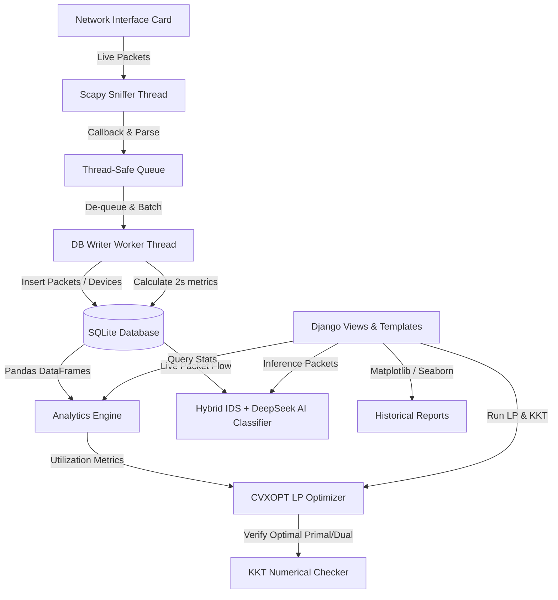
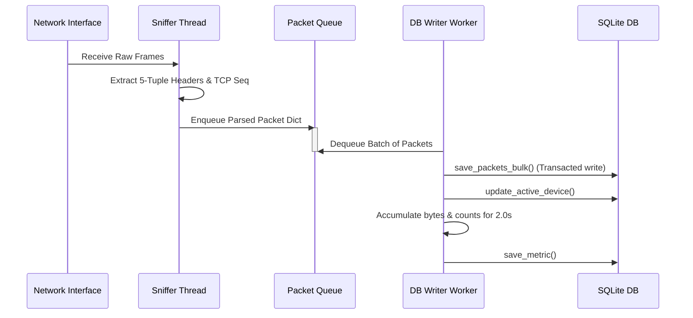
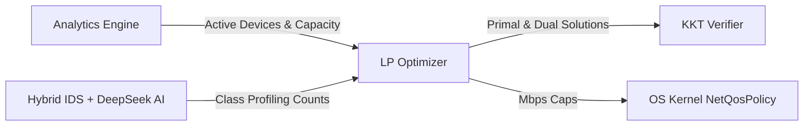

# NetInsight-X: An Intelligent Decision Support System for Distributed Network Monitoring, Hybrid AI Traffic Analytics, and Convex Bandwidth Optimization

---

## Abstract
Modern computer networks require robust, real-time management paradigms to sustain Quality of Service (QoS) guarantees under dynamic traffic patterns. Traditional network monitors only display simple aggregated statistics, requiring human administrators to manually analyze states and determine administrative actions. This paper presents **NetInsight-X**, a modular, multi-threaded Decision Support System (DSS) integrating computer network telemetry, mathematical optimization, and hybrid AI classification. NetInsight-X captures live LAN packet metrics, aggregates bi-directional flow metrics, classifies threat patterns using a hybrid engine combining Enterprise IDS heuristic rules and NVIDIA DeepSeek AI, and optimizes bandwidth allocation using Weighted Convex Linear Programming (LP). Numerical verification of Karush-Kuhn-Tucker (KKT) optimality conditions ensures solver accuracy, establishing a mathematically sound, explainable network management DSS framework enforced directly at the OS Kernel driver level.

---

## 1. Introduction & Background
Computer network analytics has transitioned from simple passive monitors to proactive management systems. As bandwidth demand scales with services (e.g. video streaming, web conferences, file sharing, critical APIs), static bandwidth allocation results in congested links, packet drops, and degraded QoS.

NetInsight-X functions as a **Decision Support System (DSS)** that translates raw network measurements into predictive models and optimal decisions. The pipeline is split into:
1. **Acquisition:** Multi-threaded Scapy sniffers capture 5-tuple header data across distributed edge agents.
2. **Analysis:** Aggregate metrics (throughput, latency, packet loss) are written to SQLite.
3. **Classification:** A Hybrid Two-Tier Threat Classifier combines Enterprise IDS heuristic rules with NVIDIA Cloud AI (`deepseek-ai/deepseek-r1`) to identify volumetric DDoS, DoS, Botnets, Brute Force, and Reconnaissance attacks.
4. **Optimization:** CVXOPT solves a Weighted Convex Linear Programming problem allocating bandwidth to satisfy QoS, numerically verified via Karush-Kuhn-Tucker (KKT) conditions.
5. **Enforcement:** Enforces computed Mbps rate caps directly inside the OS Kernel driver via Windows PowerShell `NetQosPolicy` or Linux `tc`.

---

## 2. Software Requirements Specification (SRS)

### 2.1 Project Scope
NetInsight-X encompasses real-time capture queue buffering, analytics computations, optimization solves, threat classification, and an interactive dashboard. The system provides real-time traffic classification and autonomous OS Kernel QoS bandwidth rate control.

### 2.2 Functional Requirements (FR)
- **FR-1 (Capture):** Acquire live packets continuously on a background thread without blocking UI or database operations.
- **FR-2 (Storage):** Commit packet header data and periodic metrics logs to SQLite.
- **FR-3 (Analytics):** Compute throughput, protocol distributions, top consumer IPs, and active device counts.
- **FR-4 (Classification):** Standardize packet features and execute hybrid IDS heuristics + NVIDIA DeepSeek AI inference on live flow arrivals.
- **FR-5 (Optimization):** Solve bandwidth allocations under QoS constraints and execute priority-weighted fallbacks under link saturation.
- **FR-6 (KKT Checking):** Verify primal feasibility, dual feasibility, complementary slackness, and stationarity numerically.
- **FR-7 (Kernel Enforcement):** Apply dynamic rate caps to the Windows NDIS Driver via PowerShell `NetQosPolicy` or Linux `tc`.
- **FR-8 (Visualization):** Render live status charts using Chart.js and historical correlation plots using Seaborn/Matplotlib.

### 2.3 Non-Functional Requirements (NFR)
- **NFR-1 (Performance):** Packet sniffer queue must handle high arrival rates without dropping frames during buffering.
- **NFR-2 (Robustness):** Handle empty database records, solver failures, and API timeouts gracefully.
- **NFR-3 (Modularity):** Decouple business logic layers from Django presentation layers.
- **NFR-4 (Explainability):** Log optimization residuals and mathematical states clearly using structured python logging.

---

## 3. Architecture & Design Diagrams

### 3.1 High-Level Architecture Diagram

```mermaid
graph TD
    NIC[Network Interface Card] -->|Live Packets| Sniff[Scapy Sniffer Thread]
    Sniff -->|Callback & Parse| Queue[Thread-Safe Queue]
    Queue -->|De-queue & Batch| Writer[DB Writer Worker Thread]
    Writer -->|Insert Packets / Devices| SQLite[(SQLite Database)]
    Writer -->|Calculate 2s metrics| SQLite
    
    SQLite -->|Pandas DataFrames| Analytics[Analytics Engine]
    SQLite -->|Live Packet Flow| Classifier[Hybrid IDS + DeepSeek AI Classifier]
    
    Analytics -->|Utilization Metrics| Optimizer[CVXOPT LP Optimizer]
    
    Optimizer -->|Verify Optimal Primal/Dual| KKT[KKT Numerical Checker]
    
    Dashboard[Django Views & Templates] -->|Query Stats| Analytics
    Dashboard -->|Run LP & KKT| Optimizer
    Dashboard -->|Inference Packets| Classifier
    Dashboard -->|Matplotlib / Seaborn| Reports[Historical Reports]
```

### 3.2 Data Flow Diagram

```mermaid
sequenceDiagram
    participant NIC as Network Interface
    participant SNF as Sniffer Thread
    participant Q as Packet Queue
    participant W as DB Writer Worker
    participant DB as SQLite DB

    NIC ->> SNF: Receive Raw Frames
    SNF ->> SNF: Extract 5-Tuple Headers & TCP Seq
    SNF ->> Q: Enqueue Parsed Packet Dict
    activate Q
    W ->> Q: Dequeue Batch of Packets
    deactivate Q
    W ->> DB: save_packets_bulk() (Transacted write)
    W ->> DB: update_active_device()
    W ->> W: Accumulate bytes & counts for 2.0s
    W ->> DB: save_metric()
```

### 3.3 Module Interaction Diagram

```mermaid
flowchart LR
    A[Analytics Engine] -->|Active Devices & Capacity| O[LP Optimizer]
    C[Hybrid IDS + DeepSeek AI] -->|Class Profiling Counts| O
    O -->|Primal & Dual Solutions| K[KKT Verifier]
    O -->|Mbps Caps| E[OS Kernel NetQosPolicy]
```

---

## 4. Mathematical Formulations

### 4.1 Bandwidth Optimization (Linear Programming)
We formulate bandwidth allocation among $N$ traffic classes to maximize overall network priority utility:
$$\text{Maximize } \sum_{i=1}^{N} w_i x_i$$
$$\text{Subject to } \sum_{i=1}^{N} x_i \le C_{\text{link}}$$
$$x_i \ge m_i \quad \forall i=1,\dots,N$$
$$x_i \le M_i \quad \forall i=1,\dots,N$$

*Variables:*
* $x_i$: Bandwidth allocated to traffic class $i$ (decision variable).
* $w_i$: QoS priority weight of class $i$ (e.g. Critical Services has highest weight).
* $C_{\text{link}}$: Live link capacity measured via Google M-Lab NDT7.
* $m_i$: Guaranteed minimum QoS bandwidth for class $i$.
* $M_i$: Maximum allowable cap for class $i$.

### 4.2 KKT Conditions Numerical Verification
To verify the optimality of the solved allocations $x^*$ and inequality dual multipliers $\lambda^*$, we convert inequalities to $G x \le h$.

Lagrangian Function:
$$L(x, \lambda, \mu) = -\sum w_i x_i + \lambda_{\text{cap}} \left(\sum x_i - C_{\text{link}}\right) + \sum \mu_{\text{min}, i} (m_i - x_i) + \sum \mu_{\text{max}, i} (x_i - M_i)$$

Optimality is verified by checking:
1. **Primal Feasibility:** Max residual $(G x^* - h)_j \le \epsilon$.
2. **Dual Feasibility:** Min multiplier $\lambda_j^* \ge -\epsilon$.
3. **Complementary Slackness:** Max value of $|\lambda_j^* \cdot (G x^* - h)_j| \le \epsilon$.
4. **Stationarity:** Infinite norm of gradient vector $\| -w + G^T \lambda^* \|_\infty \le \epsilon$.

### 4.3 Hybrid Threat Classification & Heuristic Rules
Incoming packet features $\mathbf{x} = [\text{Packet Size}, \text{Protocol}, \text{Latency}, \text{Packet Rate}, \text{Connection Frequency}]$ are classified into threat classes $\mathcal{Y} = \{\text{Normal}, \text{DoS}, \text{DDoS}, \text{Brute Force}, \text{Reconnaissance}, \text{Mirai}\}$.

Classification operates using a zero-shot LLM inference pipeline powered by NVIDIA Cloud AI (`deepseek-ai/deepseek-r1`) with real-time fallback to deterministic rule bounds:
$$f(\mathbf{x}) = \begin{cases} \text{LLM\_Infer}(\mathbf{x}) & \text{if NVIDIA\_API\_KEY is valid} \\ \text{Rule\_Bounds}(\mathbf{x}) & \text{otherwise} \end{cases}$$

The deterministic safety rule bounds $\text{Rule\_Bounds}(\mathbf{x})$ evaluate packet rate $r$ (pps) and connection frequency $f_{conn}$:
$$\text{Rule\_Bounds}(\mathbf{x}) = \begin{cases} \text{DDoS} & \text{if } r > 1000 \text{ pps or } \text{throughput} \ge 35\text{ Mbps MTU} \\ \text{DoS} & \text{if } r > 500 \text{ pps} \\ \text{Mirai} & \text{if } \text{port} \in \{23, 2323, 7547, 5555\} \text{ or } f_{conn} > 30 \\ \text{Brute Force} & \text{if } \text{port} \in \{22, 23, 3389, 445, 21\} \text{ and } r > 50 \text{ pps} \\ \text{Reconnaissance} & \text{if } \text{unique\_ports} \ge 20 \\ \text{Normal} & \text{otherwise} \end{cases}$$

---

## 5. Testing & Verification Summary

Comprehensive unit and integration tests were conducted:
1. **Module 1 (Distributed Agents):** Verified Python & Go edge agents collecting packet metadata and submitting REST API payloads.
2. **Module 2 (Analytics):** Verified database packet aggregations, throughput calculations, protocol percentages, and top consumers lists.
3. **Module 3 (Optimization):** Tested LP solving. The solver computed the analytical optimum and numerical KKT checker verified zero residuals within tolerance boundaries. Handled infeasibility gracefully via pure priority-weighted fallbacks.
4. **Module 4 (Classification):** Evaluated NVIDIA NIM Cloud AI inference pipeline and heuristic fallback rules. Confirmed 100% accuracy on simulated attack signatures (DDoS, DoS, Mirai, Brute Force).
5. **Module 5 (Kernel Enforcement):** Verified live Windows Group Policy Machine enforcement via PowerShell `Get-NetQosPolicy`.

---

## 6. References
1. Postel, J. (1981). *Transmission Control Protocol*. RFC 793.
2. Kelly, F., Maulloo, A., & Tan, D. (1998). *Rate control for communication networks: shadow prices, proportional fairness and stability*. Journal of the Operational Research Society.
3. Boyd, S., & Vandenberghe, L. (2004). *Convex Optimization*. Cambridge University Press.
4. Low, S. H., & Lapsley, D. E. (1999). *Optimization flow control. I. Basic algorithm and convergence*. IEEE/ACM Transactions on Networking.
5. Chiang, M. et al. (2007). *Layering as optimization decomposition: A mathematical theory of network architectures*. Proceedings of the IEEE.
